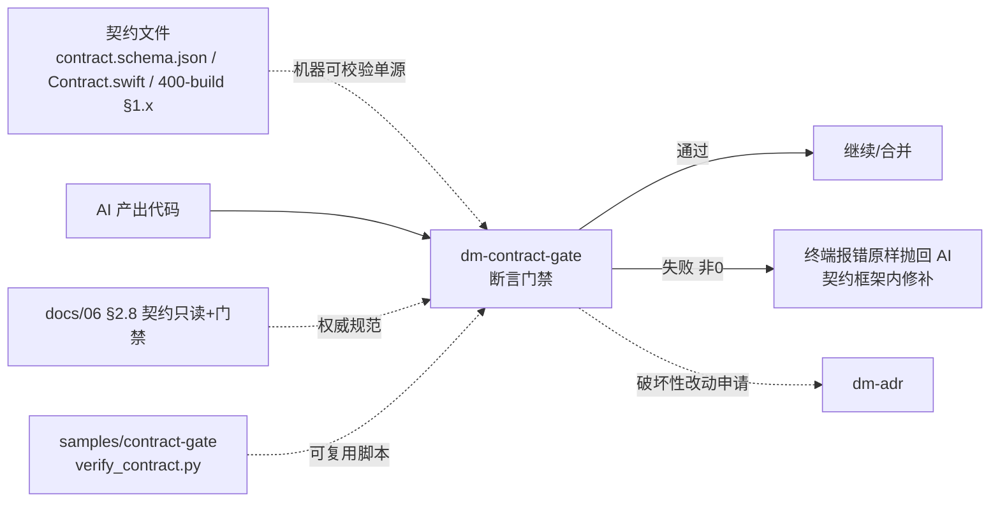

## 用户需求
将「契约文件代码化 (Schema & Interface First) + 自动化契约断言门禁」两条做法沉淀为 dev-meta 规范，覆盖三个层面：
- **文档规则**：在 `docs/06-contract-based-dev.md` 新增权威节，规定机器可校验契约、AI「改逻辑前先 diff 契约 / 严禁自改契约 / 改须申请」的只读纪律、以及自动化断言门禁（不过则把报错原样抛回 AI 修补）。
- **新增 skill**：`dm-contract-gate`（中文 `skills/dm-contract-gate.md` + 英文 `~/.codebuddy/skills/dm-contract-gate/SKILL.md`，双端结构对齐、遵循 skill-doc-principles 标准骨架）。
- **脚本样例**：`samples/contract-gate/` 提供可复用参考脚本，含 SHA256 + `contract_verified` 范式与 JSON Schema 校验，对齐用户 `package_dist.py` 既有实践。

用户已明确所选范围 = 「文档规则 + 新增 dm-contract-gate skill（中+英）+ samples/contract-gate 参考脚本」。**不改动 dm-dev-tf 等既有 skill。**

## 核心特性
- 契约只读纪律：AI 在修改任何实现代码前，先对契约文件做 diff；契约文件视为只读，破坏性改动须经 dm-adr 申请，纯增量追加须显式标注（与 06 §5 演进治理一致）。
- 自动化门禁：每次 AI 产出代码即跑契约校验脚本（SHA256 完整性 / JSON Schema 校验 / 类型检查 / 编译校验），失败则把终端报错原样抛回 AI，禁止人工读码绕过。
- 机器可校验契约：关键契约须用可 parse 格式（OpenAPI / JSON Schema / Protobuf / Swift Protocol），至少 `project-schema-design` 用 JSON Schema——这是门禁成立的前提。


## 技术栈
- 文档：Markdown（`docs/06`、`docs/07`）。
- Skill：中+英双端（遵循 `skills/skill-doc-principles.md` 标准章节骨架：概述/职责边界/触发/核心概念/执行流程/关键规则速查/资源映射/使用示例）。
- 样例脚本：Python 3（无第三方依赖，仅 `hashlib`/`json`/`argparse`），与 `package_dist.py` 的 SHA256 + `contract_verified` 范式对齐。

## 实现策略

### A. 06 新增 §2.8「契约只读约束与断言门禁」（唯一权威，不膨胀）
在 §2.7 之后、§3 之前插入，分三段：
1. **机器可校验契约**：关键契约（API/Schema/跨文件调用）须有可 parse 的单源真理文件（OpenAPI / JSON Schema / Protobuf / Swift Protocol），至少 `project-schema-design.md` 用 JSON Schema；纯 Markdown 契约无法自动校验。
2. **契约只读纪律（AI 操作约束）**：AI 改实现代码前，先对契约文件做 diff 检查改动是否打破契约；契约文件视为只读——破坏性/改语义须走 dm-adr 申请（06 §5），纯增量追加新条目允许但须 PR 标注；严禁 AI 自行改写契约本身。
3. **自动化断言门禁（Contract Assertion Gate）**：每次 AI 产出代码须立即跑契约校验脚本（SHA256 完整性 / JSON Schema / 类型检查 / `xcrun swiftc -parse`），不过则把终端报错原样抛回 AI 在契约框架内修补，禁止人工读码绕过。范式为 `contract_verified` 字段 + 文件 sha256 清单（见 samples/contract-gate）。

### B. dm-contract-gate skill（双端）
- **概述**：契约断言门禁 skill，提供可复用校验脚本并执行「AI 产出即校验、不过抛回」闭环，是 06 §2.8 的执行入口。
- **核心概念**：契约只读 / 单源真理 / SHA256 + contract_verified / 门禁失败抛回。
- **执行流程**：①定位契约文件（contract.json / *.schema.json / Contract.swift / 400-build §1.x）②运行 `verify_contract` 脚本（samples/contract-gate/verify_contract.py）③解析结果：通过则继续，失败则把报错原样返回用户/AI 补丁④契约文件变更须先经 dm-adr（破坏性）或标注纯增量。
- **关键规则速查**：契约文件只读 / 门禁不过不合并 / 报错原样抛回 / 机器可校验优先。
- 中文 `skills/dm-contract-gate.md` 与英文 `~/.codebuddy/skills/dm-contract-gate/SKILL.md` 结构对齐，仅语言不同。

### C. samples/contract-gate/ 参考脚本
- `verify_contract.py`：无依赖 Python。功能：①对契约目录生成/校验 MANIFEST.json（每个文件 sha256 + `contract_verified` 布尔）②校验 `contract.schema.json` 是否符合给定 JSON Schema（内置轻量 schema 自检或 `--schema` 指定）③`--verify` 门禁模式：返回非 0 即失败，供 CI/钩子/AI 抛回。对齐 `package_dist.py` 范式（`sha256_file`、`contract_verified`、运行时自检）。
- `contract.schema.json`：示例 JSON Schema（契约字段定义，如接口名/字段/类型/不变性），作为机器可校验契约样例。
- `MANIFEST.json`（样例）：含 `contract_verified` + 各文件 sha256，演示门禁输入。
- `README.md`：说明用法、如何接入 CI/git hook、与 06 §2.8 / dm-contract-gate 的对应关系。

### D. 引用闭环（轻量）
- 06 §4 速查表新增「契约只读与断言门禁」行（指向 §2.8 + dm-contract-gate）。
- 06 §6 引用表新增 `skills/dm-contract-gate.md` 指针（保留既有 `dm-update-contract.md（待定）` 行，二者职责不同不冲突）。
- 07 §6 衔接表末行后追加 `skills/dm-contract-gate.md` 行（门禁是 ODD 闭环在契约层的延伸）。
- `samples/README.md` 登记 `contract-gate/` 样例。

## 实现笔记
- **双端一致**：dm-contract-gate 中文设计文档与英文 SKILL.md 章节一一对应，同步修改。
- **不膨胀核心块**：06 新节标「唯一权威」，模板/skill 只引用不重定义；skill 核心摘要 ≤5 句。
- **不改动既有 skill**：dm-dev-tf 等本次不触及（不在所选范围）；仅 06/07 增引用行、samples 增样例。
- **范式对齐**：samples 脚本复用用户 `package_dist.py` 的 SHA256 + `contract_verified` 思路，不改动 PochiHide-CoreML-Spike 仓库。
- **blast radius**：仅 `docs/06`、`docs/07`、新建 `skills/dm-contract-gate.md` + `~/.codebuddy/skills/dm-contract-gate/SKILL.md`、`samples/contract-gate/*` + `samples/README.md`。
- **不提交**：改动由用户决定 commit。

## 架构设计


## 目录结构
```
dev-meta/
├── docs/
│   ├── 06-contract-based-dev.md          # [MODIFY] 新增 §2.8 契约只读约束与断言门禁；§4 速查表加行；§6 引用表加 dm-contract-gate 指针
│   └── 07-observability-driven-dev.md     # [MODIFY] §6 衔接表末行后追加 dm-contract-gate 行
├── skills/
│   └── dm-contract-gate.md                # [NEW] 契约断言门禁 skill（中文设计文档，遵循 skill-doc-principles 骨架）
├── samples/
│   ├── README.md                         # [MODIFY] 登记 contract-gate 样例
│   └── contract-gate/                    # [NEW] 参考脚本样例目录
│       ├── verify_contract.py            # [NEW] 无依赖 Python：SHA256 MANIFEST + contract_verified + JSON Schema 校验 + --verify 门禁
│       ├── contract.schema.json          # [NEW] 示例 JSON Schema（机器可校验契约样例）
│       ├── MANIFEST.json                 # [NEW] 样例清单（含 contract_verified + 各文件 sha256）
│       └── README.md                     # [NEW] 用法、CI/git-hook 接入、与 06 §2.8 对应
└── ~/.codebuddy/skills/
    └── dm-contract-gate/
        └── SKILL.md                       # [NEW] 英文部署版，结构与 skills/dm-contract-gate.md 对齐
```


# Agent Extensions
- **skill-creator**
  - Purpose: 在创建 dm-contract-gate（中文设计文档 + 英文 SKILL.md 双端）时，确保遵循 skill-doc-principles 的标准章节骨架（概述/职责边界/触发/核心概念/执行流程/关键规则速查/资源映射/使用示例）、双端结构一致、核心摘要 ≤5 句，避免格式漂移。
  - Expected outcome: dm-contract-gate 双端文件结构规范、章节对齐、lint 0，可作为 dev-meta 标准 skill 入库。
