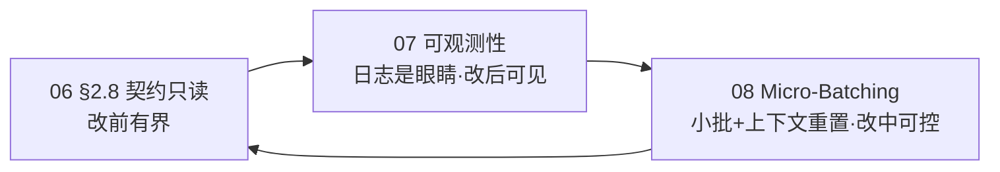

# dev-meta

开发元规范与工程标准，跨项目共享。当前以 Transaction Flow 作为版本文档主轴。

## 元数据

| 项 | 值 |
|---|---|
| 版本 | `v0.1.0` |
| 状态 | 起草中 |
| 许可证 | 待定 |

## 工作流

### 项目全生命周期

```
dm-init-docs  →  00 PRD  →  01 技术规格  →  02 系统设计  →  03 契约  →  06 可观测性  →  05 路线规划  →  plan-ver
(00~06 骨架 + ./CODEBUDDY.md 版本绑定)                                                        (小版本迭代)
```

### 版本迭代（每个小版本）

```
200-spec    →  300-design    →  400-build    →  500-schedule
(验收标准)      (架构决策)       (实现蓝图)       (排程)
```

### Git 开发流

```
版本 PR  →  TF Issue  →  commit  →  merge（保留历史）  →  关 Issue  →  清理分支
```

### 工作日志

```
每日总结表  +  详细日志  +  待办  +  里程碑  （每日穿插）
```

### Skill 工作流

```
dm-init-docs  ──→  dm-plan-ver  ──→  dm-schedule（排程）
                   │
                   ├── dm-dev-tf（TF 开发）
                   ├── dm-commit（统一提交出口）
                   └── dm-close-ver（版本收尾）

dm-log  ←── 每日穿插  ←──→  dm-commit
dm-report  ←── 阶段周报
dm-adr  ←── 按需穿插  ←──→  dm-commit
```

| Skill | 职责 | 频率 |
|-------|------|------|
| `dm-init-docs` | 初始化项目文档，生成 00~06 骨架 + `./CODEBUDDY.md` 版本绑定 | 低频 |
| `dm-plan-ver` | 开版本，创建四件套 + 分支/PR/Issue | 中频 |
| `dm-close-ver` | 关版本，就绪审计 + 保留历史 merge + 关 Issue + 清理分支 | 中频 |
| `dm-schedule` | 版本排程，工作包列表 + 防沉迷红线 | 中频 |
| `dm-dev-tf` | 启动 TF，读文档 + 确认 Issue + 出开发概要（开发在版本分支上） | 高频 |
| `dm-commit` | type 向导 + 格式校验 + Issue 关联 | 频繁 |
| `dm-log` | 每日总结 + 详细日志 + 待办 + 里程碑 | 每日 |
| `dm-report` | 从 worklog 提取生成周报/阶段报告 | 每周 |
| `dm-adr` | 维护架构/技术决策记录 | 按需 |

### CODEBUDDY 管理层

```
编辑 CODEBUDDY-global.md  →  commit  →  部署到 ~/.codebuddy/  →  全局生效
```

```
~/.codebuddy/CODEBUDDY.md  ← 全局：DoD、AI 协作、编码约定
        +（CodeBuddy 自动合并加载）
./CODEBUDDY.md              ← 项目：dev-meta 版本绑定 + 例外项
```

### AI 协作三支柱闭环

AI 不直接承接「人类视角的小版本」，而是以「单文件 / 单函数」为执行粒度，并在契约只读 + 可观测 + 小批迭代 三支柱约束下工作：



- `docs/06` 契约只读：AI 改前只 diff 契约，不自改 SSOT。
- `docs/07` 可观测性：写逻辑即写观测，编译器 / 脚本门禁把问题原样回抛。
- `docs/08` 小版本迭代：Commit 级三 Batch + Context Flush（New Session），切断长尾混乱。
- `docs/09` 架构设计指南：把 06/07/08 落到「架构形状」——人定边界（Facade/事件总线）、AI 填内部（单文件/单函数），含可直接复制的 AI 防腐规则。

## 文件

- [docs/01-project-dev-flow.md](https://github.com/aifuun/dev-meta/blob/main/docs/01-project-dev-flow.md) — 项目级开发流程与文档分层骨架
- [docs/02-version-rules.md](https://github.com/aifuun/dev-meta/blob/main/docs/02-version-rules.md) — 版本目录文件规范（schedule / spec / design / build）
- [docs/03-git-flow-rules.md](https://github.com/aifuun/dev-meta/blob/main/docs/03-git-flow-rules.md) — Git 开发流规范（小版本 PR、TF issue、commit 规范）
- [docs/04-worklog-rules.md](https://github.com/aifuun/dev-meta/blob/main/docs/04-worklog-rules.md) — 工作日志规范（每日工作总结 + 详细日志 + 待办 + 里程碑）
- [docs/05-codebuddy-management.md](https://github.com/aifuun/dev-meta/blob/main/docs/05-codebuddy-management.md) — CODEBUDDY.md 管理规范：两层架构（全局层 vs 项目层）、加载机制、迁移说明
- [docs/06-contract-based-dev.md](https://github.com/aifuun/dev-meta/blob/main/docs/06-contract-based-dev.md) — 契约式开发规范（三层契约 + 测试职责分层，唯一权威）
- [docs/07-observability-driven-dev.md](https://github.com/aifuun/dev-meta/blob/main/docs/07-observability-driven-dev.md) — 可观测性驱动开发规范（日志是 AI 的眼睛）
- [docs/08-small-batch-iteration.md](https://github.com/aifuun/dev-meta/blob/main/docs/08-small-batch-iteration.md) — 小版本迭代规范（Micro-Batching + Context Flush，唯一权威）
- [docs/09-ai-architecture-guide.md](https://github.com/aifuun/dev-meta/blob/main/docs/09-ai-architecture-guide.md) — AI 辅助开发架构设计指南（人的设计规范 + AI 执行边界，唯一权威）
- [docs/CODEBUDDY-global.md](https://github.com/aifuun/dev-meta/blob/main/docs/CODEBUDDY-global.md) — 全局规范原始版本：`~/.codebuddy/CODEBUDDY.md` 的 source of truth，在此修改后部署生效
- [templates/worklog.md](https://github.com/aifuun/dev-meta/blob/main/templates/worklog.md) — 工作日志模板
- [templates/versions/](https://github.com/aifuun/dev-meta/tree/main/templates/versions) — 版本文档模板（与规范文件一一对应）
- [templates/project/docs/](https://github.com/aifuun/dev-meta/tree/main/templates/project/docs) — 项目级文档模板（00 PRD / 01 技术规格 / 02 系统设计 / 03 契约 / 04 UI-UX / 05 路线图 / 06 可观测性）
- [templates/CODEBUDDY.md](https://github.com/aifuun/dev-meta/blob/main/templates/CODEBUDDY.md) — 项目层 CODEBUDDY 模板（版本绑定 + 例外项）
- [skills/](https://github.com/aifuun/dev-meta/tree/main/skills) — Skill 设计文档（dm-init-docs / dm-plan-ver / dm-close-ver / dm-schedule / dm-dev-tf / dm-log / dm-commit / dm-report / dm-adr / dm-arch-design / dm-contract-gate / dm-grillme-plan / dm-cleanup）
- [samples/](https://github.com/aifuun/dev-meta/tree/main/samples) — 版本文档样例（V1.4.1-indexeddb-prefs）
