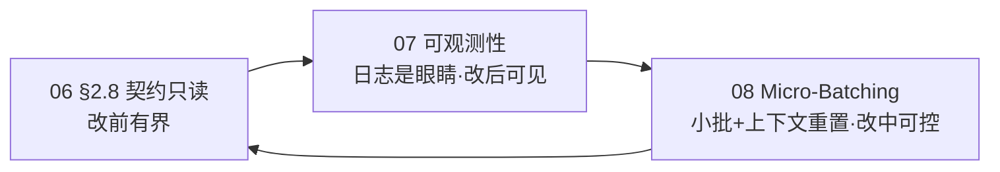

# dev-meta

开发元规范与工程标准，跨项目共享。以 Transaction Flow 作为版本文档主轴，并以「契约只读 / 可观测性 / 小批迭代」三支柱约束 AI 协作。

## 元数据

| 项 | 值 |
|---|---|
| 版本 | `v0.1.0` |
| 状态 | 起草中 |
| 许可证 | 待定 |

---

## 架构概览

dev-meta 分三层：**规范层**定义「是什么」，**skill 层**定义「怎么做」，**模板层**提供「产物骨架」。

```text
docs/01~09        规范层    唯一权威，只被引用，不重复定义
skills/           skill 层  14 个 skill，AI 可触发的标准化执行流程
templates/        模板层    项目文档 / 版本文档 / CODEBUDDY 模板
pub_local.py      发布引擎  一键发布资产 + 部署 skill（零第三方依赖）
```

### 双目录分工

skill 的产物分布在两个目录，**缺一不可**：

| 目录 | 角色 | 内容 |
|------|------|------|
| `~/.dev-meta/` | **资产 SSOT**（可脱离 CodeBuddy 使用） | 项目文档模板 `0X_*.md`、`CODEBUDDY.md`、中文 skill 源 `dm-*.md` |
| `~/.codebuddy/skills/<name>/` | **触发入口**（CodeBuddy 只从这里加载） | `SKILL.md` + `assets/` + `references/` |

> 只发布资产 → skill 不会出现在可触发列表；只部署入口 → AI 找不到模板资产。

### 单一权威 + 自动部署

每个 skill **只有一份权威**——`skills/<name>.md`（中文源，含 YAML frontmatter `name` / `description`）。
部署版 `~/.codebuddy/skills/<name>/SKILL.md` 由 `pub_local.py --deploy` **自动生成**，禁止手工编辑，从结构上消除双端漂移。

```text
skills/dm-commit.md   ──pub_local.py --deploy──▶   ~/.codebuddy/skills/dm-commit/SKILL.md
    （唯一权威，改这里）                                    （生成物，勿手改）
```

---

## 工作流

### 项目全生命周期

```
dm-init-docs  →  00 PRD  →  01 技术规格  →  02 系统设计  →  03 契约  →  06 可观测性  →  05 路线规划  →  plan-ver
(00~06 骨架 + ./CODEBUDDY.md 版本绑定)                                                        (小版本迭代)
```

### 版本迭代（每个小版本）

```
200-spec    →  300-design    →  400-build    →  500-schedule
(验收标准)      (架构决策)       (实现蓝图)       (排程)
```

### Git 开发流

```
版本 PR  →  TF Issue  →  commit  →  merge（保留历史）  →  关 Issue  →  清理分支
```

### 工作日志

```
每日总结表  +  详细日志  +  待办  +  里程碑  （每日穿插）
```

### Skill 工作流

```
dm-init-docs  ──→  dm-plan-ver  ──→  dm-schedule（排程）
                       │
                       ├── dm-dev-tf（TF 开发）
                       ├── dm-commit（统一提交出口）
                       └── dm-close-ver（版本收尾）

dm-log  ←── 每日穿插  ←──→  dm-commit
dm-report  ←── 阶段周报
dm-adr  ←── 按需穿插  ←──→  dm-commit

dm-arch-design / dm-contract-gate / dm-grillme-plan / dm-cleanup  ←── 按需
dm-pub-skill  ←── 发布 / 部署 skill 与模板
```

| Skill | 职责 | 频率 |
|-------|------|------|
| `dm-init-docs` | 初始化项目文档，生成 00~06 骨架 + `./CODEBUDDY.md` 版本绑定 | 低频 |
| `dm-plan-ver` | 开版本，创建四件套 + 分支/PR/Issue | 中频 |
| `dm-close-ver` | 关版本，就绪审计 + 保留历史 merge + 关 Issue + 清理分支 | 中频 |
| `dm-schedule` | 版本排程，工作包列表 + 防沉迷红线 | 中频 |
| `dm-dev-tf` | 启动 TF，读文档 + 确认 Issue + 出开发概要（开发在版本分支上） | 高频 |
| `dm-commit` | type 向导 + 格式校验 + Issue 关联 | 频繁 |
| `dm-log` | 每日总结 + 详细日志 + 待办 + 里程碑 | 每日 |
| `dm-report` | 从 worklog 提取生成周报/阶段报告 | 每周 |
| `dm-adr` | 维护架构/技术决策记录 | 按需 |
| `dm-arch-design` | 架构设计：人定边界（Facade / 事件总线）、AI 填内部（单文件/单函数） | 按需 |
| `dm-contract-gate` | 契约断言门禁：改前 diff、改后校验、交付对齐 MANIFEST | 高频 |
| `dm-grillme-plan` | 非版本需求写代码前的决策逼问与 Final Plan 沉淀 | 按需 |
| `dm-cleanup` | 技术债清理 + 仓库卫生（.gitignore、误提交文件） | 按需 |
| `dm-pub-skill` | 发布 / 部署：资产到 `~/.dev-meta/`、skill 触发入口到 `~/.codebuddy/skills/` | 按需 |

### CODEBUDDY 管理层

```
编辑 CODEBUDDY-global.md  →  commit  →  部署到 ~/.codebuddy/  →  全局生效
```

```
~/.codebuddy/CODEBUDDY.md  ← 全局：DoD、AI 协作、编码约定
        +（CodeBuddy 自动合并加载）
./CODEBUDDY.md              ← 项目：dev-meta 版本绑定 + 例外项
```

### AI 协作三支柱闭环

AI 不直接承接「人类视角的小版本」，而是以「单文件 / 单函数」为执行粒度，并在契约只读 + 可观测 + 小批迭代 三支柱约束下工作：



- `docs/06` 契约只读：AI 改前只 diff 契约，不自改 SSOT。
- `docs/07` 可观测性：写逻辑即写观测，编译器 / 脚本门禁把问题原样回抛。
- `docs/08` 小版本迭代：Commit 级三 Batch + Context Flush（New Session），切断长尾混乱。
- `docs/09` 架构设计指南：把 06/07/08 落到「架构形状」——人定边界（Facade/事件总线）、AI 填内部（单文件/单函数），含可直接复制的 AI 防腐规则。

---

## 使用方式

### 1. 项目接入（作为规范消费者）

1. 在项目根目录创建 `./CODEBUDDY.md`：填写 dev-meta 仓库地址与采用版本，以及本项目例外项（模板见 `templates/CODEBUDDY.md`）。
2. 通用规范（DoD、AI 协作约定、编码约定、工作日志指引）由 `~/.codebuddy/CODEBUDDY.md` **全局自动加载**，项目内**不复制规范正文**。
3. 需要项目文档骨架时，对 AI 说「初始化新项目」——`dm-init-docs` 会引导生成 `docs/00~06` + `./CODEBUDDY.md`。

> 两层 CODEBUDDY 架构详见 `docs/05-codebuddy-management.md`。
> `./CODEBUDDY.md` 是 `dm-plan-ver` / `dm-log` 的前置条件——缺失会导致后续 skill 无法确认规范绑定。

### 2. 发布与部署（作为维护者）

```bash
python3 pub_local.py                    # 发布资产到 ~/.dev-meta/
python3 pub_local.py --deploy           # 同时部署触发入口到 ~/.codebuddy/skills/
python3 pub_local.py --deploy --dry-run # 预演，不写入
```

也可以直接对 AI 说「发布 skill」/「部署模板」/「同步资产」，由 `dm-pub-skill` 编排（含前置检查与同步后校验）。

### 3. 新增 / 修改 skill

1. **只改 `skills/<name>.md`**（中文源）。新增时头部须带 YAML frontmatter：
   ```yaml
   ---
   name: dm-example
   description: 一句话说明用途 + 触发场景（用于 CodeBuddy 匹配）。
   ---
   ```
2. 资源文件放 `skills/<name>/assets/` 或 `references/`，并在中文源「资源映射」中声明。
3. 执行 `python3 pub_local.py --deploy` 生效。

> ⚠️ 不要手工编辑 `~/.codebuddy/skills/<name>/SKILL.md`——它是生成物，下次部署会被覆盖。
> 早期文档中的 `cp -r skills/dm-* ~/.codebuddy/skills/` 已废弃（会复制成文件而非目录、缺 frontmatter，不会被识别）。

### 4. 项目初始化（生成 00~06 文档）

对 AI 说「初始化新项目」/「创建项目文档骨架」，`dm-init-docs` 引导式收集意图后生成：

| 编号 | 文档 | 职责 |
|------|------|------|
| 00 | `00_PRODUCT_REQUIREMENTS.md` | 业务背景、痛点、User Story、验收标准（**业务根**） |
| 01 | `01_TECHNICAL_SPEC.md` | 技术选型、测试策略、部署基线 |
| 02 | `02_SYSTEM_DESIGN.md` | 架构、分层、数据流、并发/状态机 |
| 03 | `03_CONTRACTS_AND_API.md` | **契约 SSOT**：不可变式、API、Schema、错误码 |
| 04 | `04_UI_UX_DESIGN.md` | 交互与视图状态（**无 UI 跳过**） |
| 05 | `05_ROADMAP_AND_COMPLIANCE.md` | Milestone、版本切分、合规 |
| 06 | `06_OBSERVABILITY.md` | 可观测性实例化（`docs/07` 的项目落点） |

依赖方向 `00 → 01 → 02 → 03 → 04/05`，`02/03 → 06`；每篇头部声明流向，**只被下游引用、不反向引用下游**。

---

## 文件

### 规范文档

- [docs/01-project-dev-flow.md](https://github.com/aifuun/dev-meta/blob/main/docs/01-project-dev-flow.md) — 项目级开发流程与文档分层骨架
- [docs/02-version-rules.md](https://github.com/aifuun/dev-meta/blob/main/docs/02-version-rules.md) — 版本目录文件规范（schedule / spec / design / build）
- [docs/03-git-flow-rules.md](https://github.com/aifuun/dev-meta/blob/main/docs/03-git-flow-rules.md) — Git 开发流规范（小版本 PR、TF issue、commit 规范）
- [docs/04-worklog-rules.md](https://github.com/aifuun/dev-meta/blob/main/docs/04-worklog-rules.md) — 工作日志规范（每日工作总结 + 详细日志 + 待办 + 里程碑）
- [docs/05-codebuddy-management.md](https://github.com/aifuun/dev-meta/blob/main/docs/05-codebuddy-management.md) — CODEBUDDY.md 管理规范：两层架构（全局层 vs 项目层）、加载机制、迁移说明
- [docs/06-contract-based-dev.md](https://github.com/aifuun/dev-meta/blob/main/docs/06-contract-based-dev.md) — 契约式开发规范（三层契约 + 测试职责分层，唯一权威）
- [docs/07-observability-driven-dev.md](https://github.com/aifuun/dev-meta/blob/main/docs/07-observability-driven-dev.md) — 可观测性驱动开发规范（日志是 AI 的眼睛）
- [docs/08-small-batch-iteration.md](https://github.com/aifuun/dev-meta/blob/main/docs/08-small-batch-iteration.md) — 小版本迭代规范（Micro-Batching + Context Flush，唯一权威）
- [docs/09-ai-architecture-guide.md](https://github.com/aifuun/dev-meta/blob/main/docs/09-ai-architecture-guide.md) — AI 辅助开发架构设计指南（人的设计规范 + AI 执行边界）
- [docs/CODEBUDDY-global.md](https://github.com/aifuun/dev-meta/blob/main/docs/CODEBUDDY-global.md) — 全局规范原始版本：`~/.codebuddy/CODEBUDDY.md` 的 source of truth，在此修改后部署生效

### 模板与工具

- [templates/worklog.md](https://github.com/aifuun/dev-meta/blob/main/templates/worklog.md) — 工作日志模板
- [templates/versions/](https://github.com/aifuun/dev-meta/tree/main/templates/versions) — 版本文档模板（与规范文件一一对应）
- [templates/project/docs/](https://github.com/aifuun/dev-meta/tree/main/templates/project/docs) — 项目级文档模板（00 PRD / 01 技术规格 / 02 系统设计 / 03 契约 / 04 UI-UX / 05 路线图 / 06 可观测性）
- [templates/CODEBUDDY.md](https://github.com/aifuun/dev-meta/blob/main/templates/CODEBUDDY.md) — 项目层 CODEBUDDY 模板（版本绑定 + 例外项）
- [pub_local.py](https://github.com/aifuun/dev-meta/blob/main/pub_local.py) — 发布与部署引擎：资产 → `~/.dev-meta/`，skill 触发入口 → `~/.codebuddy/skills/`（零第三方依赖）

### Skill 与样例

- [skills/](https://github.com/aifuun/dev-meta/tree/main/skills) — Skill 中文源（14 个：dm-init-docs / dm-plan-ver / dm-close-ver / dm-schedule / dm-dev-tf / dm-log / dm-commit / dm-report / dm-adr / dm-arch-design / dm-contract-gate / dm-grillme-plan / dm-cleanup / dm-pub-skill）
- [skills/skill-doc-principles.md](https://github.com/aifuun/dev-meta/blob/main/skills/skill-doc-principles.md) — Skill 文档编写规范（章节骨架、单一权威、自动部署）
- [samples/](https://github.com/aifuun/dev-meta/tree/main/samples) — 版本文档样例（V1.4.1-indexeddb-prefs）与契约门禁样例（contract-gate）
