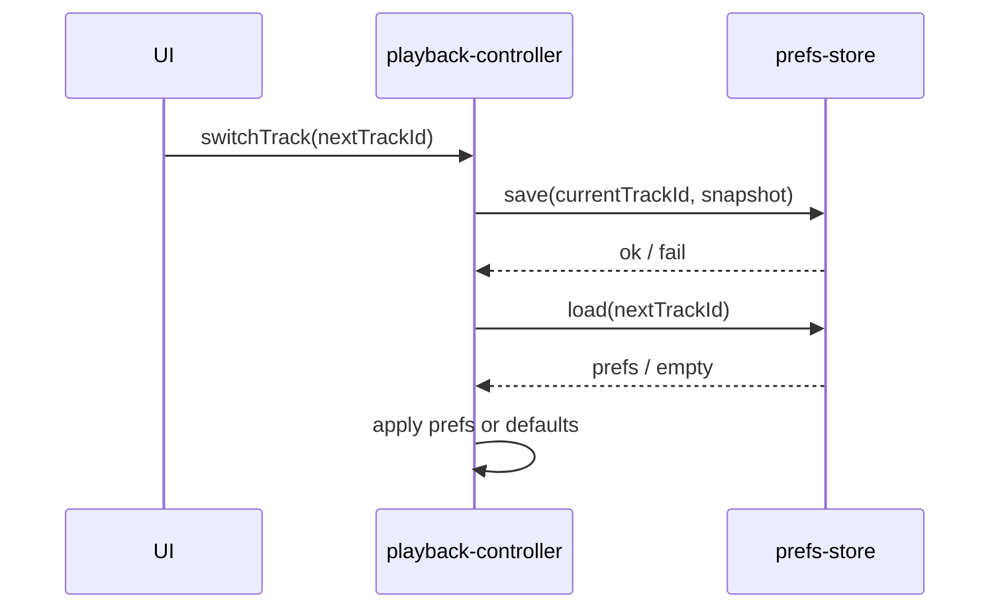

# V1.4.1 实现蓝图

## 1. 通用约束

### 1.1 数据 Schema

- 存储结构：`prefs` object store，以 `trackId` 作为主键。
- key 命名规则：`trackId`。
- 索引设计：可选的 `updatedAt` 索引用于后续清理与诊断。
- 建议字段：`trackId`、`currentTime`、`playbackRate`、`abLoop`、`updatedAt`。

### 1.2 API 契约

- `audio-store.openDB()`：打开数据库并返回 DB 实例。
- `audio-store.closeDB()`：关闭数据库连接。
- `audio-store.getStorageEstimate()`：查询当前存储配额与使用量。
- `prefs-store.save(trackId, snapshot)`：保存单曲偏好。
- `prefs-store.load(trackId)`：加载单曲偏好。
- `prefs-store.delete(trackId)`：删除单曲偏好。
- `prefs-store.deleteAll()`：删除全部偏好。

### 1.3 异常与边界

- 失败重试：写入失败不阻塞播放，后续 tick 或下次切歌自然覆盖。
- 并发冲突：以最后一次成功写入为准。
- 配额不足：静默降级，不阻断播放。
- 大数据量：优先按 `trackId` 定向读写，不做全量扫描。

### 1.4 防腐契约

> ID 用 `GUARD-01` 递增（沿用 `docs/06` §2.6 域-序号），**与契约层级 L1 / L2 / L3 无关**。

| ID | 拦截目标 | 校验命令 | 作用 |
|---|---|---|---|
| GUARD-01 | `prefs-store.js` 依赖 DOM / Engine 实例 | `grep -nE "document\.\|window\.\|engine\." src/storage/prefs-store.js` 为 0 | 保证存储层可独立单测 |
| GUARD-02 | prefs-store 写操作阻塞 UI 线程与播放时钟 | 单测 + 真机计时（写入耗时 < 5ms） | 保证播放时钟不被持久化拖慢 |

## 2. Step 0–7 施工清单

> 固定 8 行，不得增删。必做步（S0 / S1 / S6 / S7）不得标记 `⏭️ SKIPPED`。

| Step | 名称 | 状态 | 环节 | guard | 交付物 / 跳过理由 |
|---|---|---|---|---|---|
| S0 | Scaffold & Clean | 执行 | 开发 | — | 分支与工程配置就绪（本样例工程已存在，无遗留需清理） |
| S1 | Contract & ADR | 执行 | 设计 | — | STORE-001 契约冻结；主键与降级策略决策记录 |
| S2 | Core & Prototype | 执行 | 开发 | GUARD-01 | `audio-store.js` + `prefs-store.js` 建造（只造引擎，不碰播放器） |
| S3 | Standard Finalization | ⏭️ SKIPPED | — | — | 跳过：本版本无量化门禁（偏好读写非性能敏感路径，不设阈值） |
| S4 | Ingress Migration | 执行 | 开发 | GUARD-02 | `switchTrack()` 先存后恢复；`startTimingLoop()` 节流写入 |
| S5 | Egress Migration | 执行 | 开发 | GUARD-02 | `deleteTrack()` / `clearPlaylist()` 清理偏好 |
| S6 | Guards & Tests | 执行 | 测试 | GUARD-01,02 | 静态守卫全绿 + Web 版 24 项回归通过 |
| S7 | Verification & Close | 执行 | 发布 | — | 浏览器真机验收（含隐私模式）、Tag、收口 |

> **粒度自检**：S4 / S5 **各只出现一次** ✅（切歌与清理各归一处，未出现第三处切线点）。

## 3. Step 明细

### 3.1 S0 Scaffold & Clean

- 目标：确认工作分支与工程配置就绪，无历史遗留（无未清理分支、无废弃远端）。
- 步骤拆解：
  1. 从 `main` 切出 `feature/v1.4.1-indexeddb-prefs`
  2. 确认构建与本地预览可跑通
- 输入输出与前置条件：无代码改动，仅工程操作。
- 异常与边界：不涉及。

### 3.2 S1 Contract & ADR

- 目标：冻结存储层接口签名与降级策略，先于任何实现。
- 步骤拆解：
  1. 定义 `prefs-store` / `audio-store` 接口签名（见 §1.2）
  2. 落 `STORE-001` 契约（归属 / 方向 / 不变性 / 真值来源）
  3. 记录关键决策：以 `trackId` 为主键、异步节流写入、静默降级
- 异常与边界：契约变更须先改契约再改实现（`dm-contract-gate` Gate 1）。

### 3.3 S2 Core & Prototype

> 只造引擎，不装车 —— 本步**禁止改动播放器主流程**。

- 目标：建成可独立单测的存储引擎，含能力探测与降级包装。
- 步骤拆解：
  1. `audio-store.js`：`openDB()` / `closeDB()` / `getStorageEstimate()`，并在 `initStorage()` 中探测可用性
  2. `prefs-store.js`：`save` / `load` / `delete` / `deleteAll`，内部只经 `audio-store`
  3. `safePrefsCall(operation)`：能力不可用时返回默认结果，**不抛**
- 函数签名与伪代码：

```text
func initStorage() -> void
func safePrefsCall(operation: function) -> any
  // 前置条件：播放器初始化阶段
  // 调用时机：存储能力探测与包装调用
```

```text
function initStorage():
  try:
    db = audioStore.openDB()
    storageAvailable = true
  catch error:
    storageAvailable = false

function safePrefsCall(operation):
  if not storageAvailable:
    return defaultResult
  try:
    return operation()
  catch error:
    return defaultResult
```

- 输入输出与前置条件：
  - 输入：IndexedDB 可用性检测结果
  - 输出：偏好读写结果 / 默认结果
  - 前置条件：播放器初始化完成
  - 后置条件：即使偏好层失败，播放仍可持续
- 异常与边界：
  - 异常场景：隐私模式、配额满、版本升级失败、页面反复重载
  - 回退策略：默认值起播，记录可忽略
  - 重试策略：仅在下次初始化时重新探测

#### 关键行为契约

| 函数 | 场景 | 预期（given-when-then） |
|------|------|------------------------|
| `save` | IndexedDB 不可用 | given 存储不可用 → when 调用 save → then 不抛异常、返回失败标记，播放不受影响 |
| `load` | 无该 trackId 记录 | given 无历史记录 → when 调用 load → then 返回空结果，由调用方回退默认值 |

### 3.4 S4 Ingress Migration

- 目标：把播放链路（切歌、定时刷写）接入 S2 的存储引擎。
- 步骤拆解：
  1. `switchTrack(nextTrackId)`：先 `save(当前曲)`，再 `load(目标曲)`，成功则应用、无记录则默认值
  2. `startTimingLoop()`：在 tick 中按节流条件写入 `currentTime` / 倍速 / AB
  3. 两条链路均经 `safePrefsCall` 包装，失败静默
- 函数签名与伪代码：

```text
func switchTrack(nextTrackId: string) -> void
func timingLoopTick(now: number) -> void
  // 前置条件：当前与目标 trackId 可解析；存在可播放曲目
  // 调用时机：切歌编排流程中；startTimingLoop 定时 tick
```

```text
function switchTrack(nextTrackId):
  currentSnapshot = captureCurrentPlaybackState()
  safePrefsCall(() => prefsStore.save(currentTrackId, currentSnapshot))

  nextPrefs = prefsStore.load(nextTrackId)
  if nextPrefs exists:
    applyPlaybackState(nextPrefs)
  else:
    applyDefaultPlaybackState()

  continue switching

function timingLoopTick(now):
  if shouldThrottleWrite(now):
    snapshot = captureCurrentPlaybackState()
    safePrefsCall(() => prefsStore.save(trackId, snapshot))
    updateLastWriteTime(now)
```

- 输入输出与前置条件：
  - 输入：当前 / 目标 trackId、currentTime、playbackRate、AB 状态
  - 输出：目标曲恢复态 / 最新偏好记录
  - 前置条件：播放器处于可切换状态；当前存在可播放曲目
  - 后置条件：当前曲目状态已尽力持久化；目标曲状态已恢复或回退默认值
- 异常与边界：
  - 异常场景：保存失败、读取失败、无历史记录、写入频率过高、标签页挂起
  - 回退策略：保存失败静默吞掉；读取失败使用默认值；保持最后一次成功写入结果
  - 重试策略：由后续 tick 自然重试，不做同步阻塞重试

### 3.5 S5 Egress Migration

- 目标：删除轨道或清空列表时同步清理偏好，避免残留污染后续导入。
- 步骤拆解：
  1. `deleteTrack(trackId)` → `prefsStore.delete(trackId)`
  2. `clearPlaylist()` → `prefsStore.deleteAll()`
  3. 清理失败不影响主删除 / 清空流程
- 函数签名与伪代码：

```text
func deleteTrack(trackId: string) -> void
func clearPlaylist() -> void
  // 前置条件：删除或清空动作已确认
  // 调用时机：列表管理与引擎删除路径
```

```text
function deleteTrack(trackId):
  removeTrackFromPlaylist(trackId)
  safePrefsCall(() => prefsStore.delete(trackId))

function clearPlaylist():
  clearPlaylistData()
  safePrefsCall(() => prefsStore.deleteAll())
```

- 输入输出与前置条件：
  - 输入：trackId 或清空事件
  - 输出：对应偏好记录被删除
  - 前置条件：轨道已确定要删除或列表已确定要清空
  - 后置条件：偏好残留被尽力清理
- 异常与边界：
  - 异常场景：部分删除失败、批量清理失败、IDB 不可用
  - 回退策略：主业务先完成，偏好清理尽力而为
  - 重试策略：不做前台阻塞重试

### 3.6 S6 Guards & Tests

- 目标：静态守卫锁住架构红线，全量回归证明无行为回退。
- 步骤拆解：
  1. 跑 GUARD-01 / GUARD-02 静态扫描与耗时断言
  2. 跑全量单测（存储层可独立实例化）
  3. 跑 Web 版 24 项回归
- 异常与边界：守卫或回归未全绿**不得**进入 S7。

### 3.7 S7 Verification & Close

- 目标：真机（浏览器）验收并收口。
- 步骤拆解：
  1. 正常模式验收切歌恢复、删除清理
  2. **隐私模式验收静默降级**（IndexedDB 不可用）
  3. 合并（保留历史）、打 Tag、关闭版本 Issue
- 异常与边界：隐私模式验收不通过则退回 S2 / S4 修复。

## 4. 风险与缓解

| 风险 | 影响 | 缓解措施 |
|---|---|---|
| IndexedDB 不可用 | 偏好无法持久化 | 静默降级，继续使用默认值 |
| 写入太频繁 | 影响性能 | 节流写入 currentTime |
| 删除后残留 | 重新导入同名文件时恢复旧偏好 | `deleteTrack` / `deleteAll` 强制清理 |
| 版本升级 | 旧数据结构兼容性风险 | 仅按缺省值读取，不依赖旧字段存在 |

## 5. 状态机 / 时序图



## 6. 自检与验收

> 每 Step 提 PR 前跑：grep / 单测 / diff 行数。规范指针 `dm-contract-gate`。

- S1：契约检查全绿（`dm-contract-gate` Gate 1–3）
- S2：`grep -nE "document\.|window\.|engine\." src/storage/prefs-store.js` 为 0（GUARD-01）
- S4 / S5：写入耗时断言 < 5ms（GUARD-02）
- S6：全量单测 + Web 版 24 项回归全通过，0 warning / 0 error
- S7：浏览器真机验收通过（含隐私模式）、Tag 已推送
- S4 / S5 顺序：S2 完成后 S4 与 S5 可并行（共享受同一 `prefs-store` 门面）
