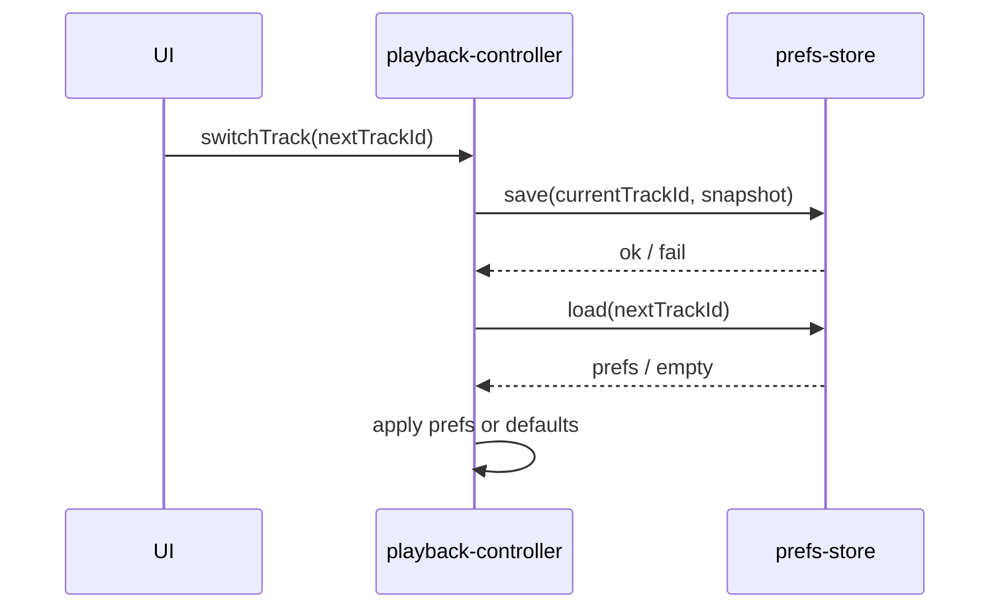

# V1.4.1 详细设计

## 1. 通用约束

### 1.1 数据 Schema

- 存储结构：`prefs` object store，以 `trackId` 作为主键。
- key 命名规则：`trackId`。
- 索引设计：可选的 `updatedAt` 索引用于后续清理与诊断。
- 建议字段：`trackId`、`currentTime`、`playbackRate`、`abLoop`、`updatedAt`。

### 1.2 API 契约

- `audio-store.openDB()`：打开数据库并返回 DB 实例。
- `audio-store.closeDB()`：关闭数据库连接。
- `audio-store.getStorageEstimate()`：查询当前存储配额与使用量。
- `prefs-store.save(trackId, snapshot)`：保存单曲偏好。
- `prefs-store.load(trackId)`：加载单曲偏好。
- `prefs-store.delete(trackId)`：删除单曲偏好。
- `prefs-store.deleteAll()`：删除全部偏好。

### 1.3 异常与边界

- 失败重试：写入失败不阻塞播放，后续 tick 或下次切歌自然覆盖。
- 并发冲突：以最后一次成功写入为准。
- 配额不足：静默降级，不阻断播放。
- 大数据量：优先按 `trackId` 定向读写，不做全量扫描。

## 2. TF1 详细设计

### 2.1 目标

- 在切歌时先保存当前曲目的偏好，再恢复目标曲目的偏好。
- 成功条件：切回同一曲目时，进度、倍速、AB 循环状态按最近一次保存值恢复。

### 2.2 步骤拆解

1. 读取当前曲目的 trackId 与播放器状态。
2. 调用 `prefsStore.save(currentTrackId, snapshot)` 保存当前状态。
3. 读取目标曲目的偏好记录。
4. 若读取成功，应用进度、倍速、AB 循环到播放器。
5. 若读取失败或无记录，应用默认值。
6. 完成轨道切换。

### 2.3 函数签名与伪代码

- 关键函数签名（函数名、入参类型、返回值类型、调用时机）：
```text
func switchTrack(nextTrackId: string) -> void
  // 前置条件：当前与目标 trackId 已可解析
  // 调用时机：切歌编排流程中
```

```text
function switchTrack(nextTrackId):
  currentSnapshot = captureCurrentPlaybackState()
  try:
    prefsStore.save(currentTrackId, currentSnapshot)
  catch error:
    swallow error and continue

  nextPrefs = prefsStore.load(nextTrackId)
  if nextPrefs exists:
    applyPlaybackState(nextPrefs)
  else:
    applyDefaultPlaybackState()

  continue switching
```

### 2.4 输入输出与前置条件

- 输入：当前 trackId、目标 trackId、当前播放器状态。
- 输出：目标曲目的恢复态。
- 前置条件：播放器处于可切换状态，`trackId` 可识别。
- 后置条件：当前曲目状态已尽力持久化，目标曲目状态已恢复或回退到默认值。

### 2.5 异常与边界

- 异常场景：保存失败、读取失败、目标曲目无历史记录、IndexedDB 不可用。
- 回退策略：保存失败静默吞掉，读取失败使用默认值。
- 重试策略：非阻塞场景下允许下次定时刷写自然覆盖。

## 3. TF2 详细设计

### 3.1 目标

- 在播放过程中按节流周期保存 currentTime、倍速与 AB 循环状态。
- 成功条件：用户切歌或重启后，曲目能从最近保存点恢复。

### 3.2 步骤拆解

1. 在 `startTimingLoop()` 中定期采样当前播放状态。
2. 只在满足节流条件时执行写入。
3. 调用 `prefsStore.save(trackId, snapshot)` 写入偏好。
4. 记录最近一次成功写入时间。

### 3.3 函数签名与伪代码

- 关键函数签名（函数名、入参类型、返回值类型、调用时机）：
```text
func timingLoopTick(now: number) -> void
  // 前置条件：当前存在可播放曲目
  // 调用时机：startTimingLoop 定时 tick
```

```text
function timingLoopTick():
  if shouldThrottleWrite(now):
    snapshot = captureCurrentPlaybackState()
    try:
      prefsStore.save(trackId, snapshot)
    catch error:
      swallow error
    updateLastWriteTime(now)
```

### 3.4 输入输出与前置条件

- 输入：当前 trackId、currentTime、playbackRate、AB 状态。
- 输出：最新偏好记录。
- 前置条件：当前存在可播放曲目。
- 后置条件：本次快照已写入或被静默降级。

### 3.5 异常与边界

- 异常场景：写入频率过高、页面失焦、标签页挂起、IDB 不可用。
- 回退策略：保持最后一次成功写入结果，不阻塞播放。
- 重试策略：由后续 tick 自然重试，不做同步阻塞重试。

## 4. TF3 详细设计

### 4.1 目标

- 删除轨道或清空列表时清理偏好数据，避免残留污染后续导入。

### 4.2 步骤拆解

1. `deleteTrack(trackId)` 时调用 `prefsStore.delete(trackId)`。
2. `clearPlaylist()` 时调用 `prefsStore.deleteAll()`。
3. 清理动作失败时不影响主删除/清空流程。

### 4.3 函数签名与伪代码

- 关键函数签名（函数名、入参类型、返回值类型、调用时机）：
```text
func deleteTrack(trackId: string) -> void
func clearPlaylist() -> void
  // 前置条件：删除或清空动作已确认
  // 调用时机：列表管理与引擎删除路径
```

```text
function deleteTrack(trackId):
  removeTrackFromPlaylist(trackId)
  try:
    prefsStore.delete(trackId)
  catch error:
    swallow error

function clearPlaylist():
  clearPlaylistData()
  try:
    prefsStore.deleteAll()
  catch error:
    swallow error
```

### 4.4 输入输出与前置条件

- 输入：trackId 或清空事件。
- 输出：对应偏好记录被删除。
- 前置条件：轨道已确定要删除或列表已确定要清空。
- 后置条件：偏好残留被尽力清理。

### 4.5 异常与边界

- 异常场景：部分删除失败、批量清理失败、IDB 不可用。
- 回退策略：主业务先完成，偏好清理尽力而为。
- 重试策略：不做前台阻塞重试。

## 5. TF4 详细设计

### 5.1 目标

- 当 IndexedDB 在隐私模式或能力受限场景不可用时，播放器仍可正常工作。

### 5.2 步骤拆解

1. 启动时调用 `audioStore.openDB()` 做可用性探测。
2. 若打开失败，标记 prefs 能力不可用。
3. 后续 `load/save/delete/deleteAll` 统一走静默降级分支。
4. 播放主流程继续依赖默认值。

### 5.3 函数签名与伪代码

- 关键函数签名（函数名、入参类型、返回值类型、调用时机）：
```text
func initStorage() -> void
func safePrefsCall(operation: function) -> any
  // 前置条件：播放器初始化阶段
  // 调用时机：存储能力探测与包装调用
```

```text
function initStorage():
  try:
    db = audioStore.openDB()
    storageAvailable = true
  catch error:
    storageAvailable = false

function safePrefsCall(operation):
  if not storageAvailable:
    return defaultResult
  try:
    return operation()
  catch error:
    return defaultResult
```

### 5.4 输入输出与前置条件

- 输入：IndexedDB 可用性检测结果。
- 输出：内存态/静默失败策略。
- 前置条件：播放器初始化完成。
- 后置条件：即使偏好层失败，播放仍可持续。

### 5.5 异常与边界

- 异常场景：隐私模式、配额满、版本升级失败、页面反复重载。
- 回退策略：默认值起播，记录可忽略。
- 重试策略：仅在下次初始化时重新探测。

## 6. 风险与缓解

| 风险 | 影响 | 缓解措施 |
|---|---|---|
| IndexedDB 不可用 | 偏好无法持久化 | 静默降级，继续使用默认值 |
| 写入太频繁 | 影响性能 | 节流写入 currentTime |
| 删除后残留 | 重新导入同名文件时恢复旧偏好 | deleteTrack / deleteAll 强制清理 |
| 版本升级 | 旧数据结构兼容性风险 | 仅按缺省值读取，不依赖旧字段存在 |

## 7. 状态机 / 时序图



## 8. 任务执行计划

| 序号 | TF | 任务简述 | 预估 | 备注 |
|------|-----|---------|------|------|
| 1 | TF4 | 设计并实现 IndexedDB 可用性探测与静默降级 | 0.5d | 基础设施，必须最先做，兜底所有后续 TF |
| 2 | TF1 | 实现切歌时先存后读偏好 | 1d | 与 TF2 可并行 |
| 3 | TF2 | 在 timing loop 中节流写入 currentTime | 1d | 与 TF1 可并行 |
| 4 | TF3 | 删除轨道与清空列表时清理偏好 | 0.5d | |
| 5 | — | 补单测与回归用例 | 1d | 需全部 TF 完成 |
| 6 | — | 本地构建与回归验证 | 0.5d | 需全部 TF 完成 |

### 执行顺序

- 推荐先做：TF4，作为所有后续 TF 的兜底
- 可并行：TF1 与 TF2（需共享 prefs-store 接口定义）
- 必须串行：TF4 → TF1/TF2/TF3
