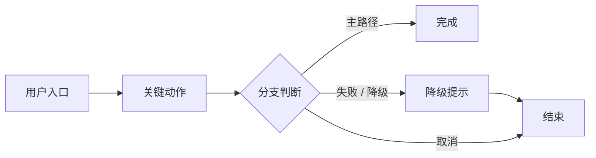

# VX.Y 特性规格

> 模板用途：快速起草背景（小白向）、用户旅程（用例）、交付范围、架构锚点与验收标准。
> 结构唯一权威：`docs/02-version-rules.md` §4。
> 两个无编号前言块（`## 背景（小白向）` / `## 用户旅程（用例）`）是 200-spec 中**唯一允许**的无编号章节，顺序固定，不得新增其他无编号块。
> ⚠️ 本文件**不得出现** `Transaction Flow` / `TF` / `Step` 章节（施工拆分属 `400-build.md`）。

\<一句话讲清本版本的**单一核心业务场景**；并写明版本范围内不包含什么。\>

<!-- 前言区：先讲人话（背景），再讲流程（旅程），之后才进入 `## 1. 架构锚点` -->

## 背景（小白向）

<!-- 面向零前置知识读者：这项工作是什么、为什么现在做、给谁用。是一句话场景的展开版，不重复其内容。
     允许用术语，但每个术语首次出现时须紧跟一句白话解释；只讲「是什么、为什么」，不讲怎么做。≤ 150 字 -->

## 用户旅程（用例）

<!-- 主图：用户使用该特性的完整走向。节点用「用户动作」命名（不用类名 / 函数名），含分支节点；节点量级 ≤ 12（含起止）。
     图下表格 ≤ 5 行，覆盖主路径 + 关键失败 / 降级 / 取消分支；细碎异常（并发 / 超时 / 重试）留 300-design。
     图外说明 ≤ 3 行，且不与图表重复。 -->

| 分支 | 触发条件 | 期望行为 |
|---|---|---|
| 主路径 |  |  |
| 失败 / 降级 |  |  |
| 取消 |  |  |

## 1. 架构锚点（本版本触及的架构面）

> 只登记「动到哪 + 红线」，**不写为什么这样设计**（论证属 `300-design.md`）。
> 五维术语权威：`dm-arch-design` skill / `docs/09-ai-architecture-guide.md`。

<!-- 一张表装下五维，不各起子表。层名取本项目架构 SSOT；契约 ID 用「域-序号」（如 CTR-001），含四要素 + 状态，落盘本项目契约 SSOT（docs/06 §4） -->

| 维度 | 本版本触及 | 硬约束 / 红线 |
|---|---|---|
| 分层 |  |  |
| 模块 |  |  |
| 门面 |  |  |
| 契约 |  |  |
| API |  |  |

### 1.1 明确不做（技术 / 范围）

<!-- 技术 = 禁用的技术路径；范围 = 本次不做的模块 / 不重构的债 / 不引入的模式 -->

| 项 | 类型 | 理由 / 归属 |
|---|---|---|
|  | 技术 / 范围 |  |

## 2. 功能验收标准

| 验收项 | 验证方法 | 通过标准 |
|---|---|---|
|  |  |  |

## 3. 架构验收标准

| 验收项 | 通过标准 |
|---|---|
|  |  |

## 4. DoD (Definition of Done)

> **确认类** checklist —— 只写「是否已确认 / 已通过」，**不写实现任务清单**（任务清单属 `400-build.md` 与 `500-schedule.md`）。

- [ ] 背景（小白向）已确认（零前置知识可读，术语首次出现已紧跟白话解释）
- [ ] 用户旅程已确认（主路径 + 关键失败 / 降级 / 取消分支齐全，且与架构锚点无重复）
- [ ] 核心业务场景已确认（单一场景，一句话可述）
- [ ] 架构锚点已确认（§1 分层 / 模块 / 门面 / 契约 / API 均已登记）
- [ ] 受影响契约已回写至契约 SSOT
- [ ] 验收标准已确认
- [ ] 相关设计文档已评审通过
- [ ] 测试策略已定义（见 design.md 测试策略章节）
- [ ] 关键测试场景已通过
