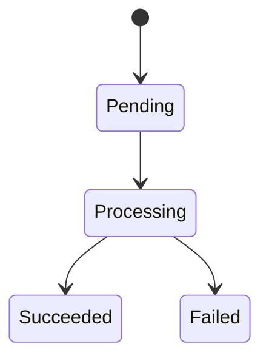

# VX.Y 实现蓝图

## 1. 通用约束

### 1.1 数据 Schema

- 存储结构：
- key 命名规则：
- 索引设计：

### 1.2 API 契约

> 契约规范与字段定义见 `docs/06-contract-based-dev.md` §2.1。

- 调用顺序：
- 前置条件：
- 返回值约定：

### 1.3 异常与边界

- 失败重试：
- 并发冲突：
- 配额不足：
- 大数据量：

### 1.4 防腐契约

> ID 用 `GUARD-01` 递增（沿用 `docs/06` §2.6 域-序号），**与契约层级 L1 / L2 / L3 无关**。

| ID | 红线 | 校验方式 |
|---|---|---|
| GUARD-01 |  |  |

## 2. TF1 实现

### 2.1 目标

- 该流要完成什么：
- 成功条件：

### 2.2 步骤拆解

1. 第一步：
2. 第二步：
3. 第三步：

### 2.3 函数签名与伪代码

- 关键函数签名（函数名、入参类型、返回值类型、调用时机）：
```text
func StepA(input: InputType) -> (OutputType, error)
  // 前置条件：
  // 调用时机：
```

```text
if 前置条件不满足:
  return 失败原因

执行步骤 A
执行步骤 B
根据结果决定下一步
```

#### 关键行为契约（关键测试用例，可选）
> 仅对算法类 / 有隐性契约（幂等、并发去重、异常分支、降级取舍）的函数填写；薄胶水 / CRUD 函数可省略。本表是「行为规定」而非「测试实现」，dm-dev-tf 落地时据此生成真实单测。分工见 `docs/06-contract-based-dev.md` §3（测试职责分层）。

| 函数 | 场景 | 预期（given-when-then） |
|------|------|------------------------|
| StepA | 前置条件不满足 | given 输入非法 → when 调用 StepA → then 返回明确错误，不抛未定义异常 |
|  |  |  |

### 2.4 输入输出与前置条件

- 输入：
- 输出：
- 前置条件：
- 后置条件：

### 2.5 异常与边界

- 异常场景：
- 回退策略：
- 重试策略：

## 3. TF2 实现

### 3.1 目标

- 该流要完成什么：
- 成功条件：

### 3.2 步骤拆解

1. 第一步：
2. 第二步：
3. 第三步：

### 3.3 函数签名与伪代码

- 关键函数签名（函数名、入参类型、返回值类型、调用时机）：
```text
func StepA(input: InputType) -> (OutputType, error)
  // 前置条件：
  // 调用时机：
```

```text
if 前置条件不满足:
  return 失败原因

执行步骤 A
执行步骤 B
根据结果决定下一步
```

#### 关键行为契约（关键测试用例，可选）
> 仅对算法类 / 有隐性契约（幂等、并发去重、异常分支、降级取舍）的函数填写；薄胶水 / CRUD 函数可省略。本表是「行为规定」而非「测试实现」，dm-dev-tf 落地时据此生成真实单测。分工见 `docs/06-contract-based-dev.md` §3（测试职责分层）。

| 函数 | 场景 | 预期（given-when-then） |
|------|------|------------------------|
| StepA | 前置条件不满足 | given 输入非法 → when 调用 StepA → then 返回明确错误，不抛未定义异常 |
|  |  |  |

### 3.4 输入输出与前置条件

- 输入：
- 输出：
- 前置条件：
- 后置条件：

### 3.5 异常与边界

- 异常场景：
- 回退策略：
- 重试策略：

## 4. 风险与缓解

| 风险 | 影响 | 缓解措施 |
|---|---|---|
|  |  |  |

## 5. 状态机 / 时序图

> 当 Transaction Flow 涉及复杂异步状态或跨端交互时，本节必须补充文本状态机或时序图。



## 6. 执行顺序矩阵

> 只承载顺序、环节、依赖约束与验收约束（guard）；任务简述、预估工时、状态统一由 `500-schedule.md` 维护。

| 序号 | 环节 | TF | guard | 备注 |
|------|------|-----|-------|------|
| 1 | 开发 | TF1 | GUARD-01 |  |
| 2 | 部署+联调 | TF1 | — | 归属 dev，不归 qa |
| 3 | 测试 | — | — | qa 验收已部署+已联调功能 |

> 环节取值：调研 / 定位 / 设计 / 规格 / 开发 / 构建 / 部署 / 联调 / 测试 / 发布（与 `dm-schedule` 环节↔类别表一致）。dev TF 的矩阵须含「代码 + 部署 + 联调」环节。
> 自检（每 TF 提 PR 前跑）：grep / 单测 / diff 行数 —— 规范见 `dm-contract-gate`

### 执行顺序

- 推荐先做：
- 可并行：
- 必须串行：
