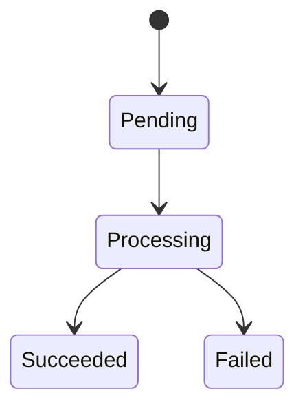

# VX.Y 实现蓝图

> 模板用途：Step 0–7 施工清单与明细、防腐契约、自检。
> 结构唯一权威：`docs/02-version-rules.md` §6。
> **本文件是唯一承载施工拆分的文档** —— `200-spec` / `300-design` 不得出现 Step 章节。

## 1. 通用约束

### 1.1 数据 Schema

- 存储结构：
- key 命名规则：
- 索引设计：

### 1.2 API 契约

> 契约规范与字段定义见 `docs/06-contract-based-dev.md` §2.1。

- 调用顺序：
- 前置条件：
- 返回值约定：

### 1.3 异常与边界

- 失败重试：
- 并发冲突：
- 配额不足：
- 大数据量：

### 1.4 防腐契约

> ID 用 `GUARD-01` 递增（沿用 `docs/06` §2.6 域-序号），**与契约层级 L1 / L2 / L3 无关**。

| ID | 拦截目标 | 校验命令 | 作用 |
|---|---|---|---|
| GUARD-01 |  |  |  |

## 2. Step 0–7 施工清单

> 固定 8 行，**不得增删**。必做步（S0 / S1 / S6 / S7）不得标记 `⏭️ SKIPPED`。
> 跳过声明唯一合法格式：状态填 `⏭️ SKIPPED`，末列写「跳过：\<理由\>」。

| Step | 名称 | 状态 | 环节 | guard | 交付物 / 跳过理由 |
|---|---|---|---|---|---|
| S0 | Scaffold & Clean | 执行 | 开发 | — | 干净分支、工程配置就位 |
| S1 | Contract & ADR | 执行 | 设计 | — | ADR 已记录、契约已冻结 |
| S2 | Core & Prototype | ⏭️ SKIPPED | — | — | 跳过：本版本无核心算法与数据量化需求 |
| S3 | Standard Finalization | ⏭️ SKIPPED | — | — | 跳过：前置 S2 已跳过，无实测数据需回填 |
| S4 | Ingress Migration | 执行 | 开发 | GUARD-01 | 预览链路接入新引擎 |
| S5 | Egress Migration | 执行 | 开发 | GUARD-01 | 导出链路接入新引擎 |
| S6 | Guards & Tests | 执行 | 测试 | GUARD-01 | 静态守卫 + 全量回归全绿 |
| S7 | Verification & Close | 执行 | 发布 | — | Tag、Issue 矩阵、收口报告 |

> **粒度自检（硬判据）**：S4 / S5 **各只出现一次**。出现多于一次 → 版本过大，退回 `dm-plan-roadmap` 重切。

## 3. Step 明细

> 对**每个状态为执行**的 Step 展开一小节（`⏭️ SKIPPED` 的不展开）。

### 3.1 S0 Scaffold & Clean

- 目标：
- 步骤拆解：
  1. 第一步：
  2. 第二步：
- 函数签名与伪代码：

```text
func StepA(input: InputType) -> (OutputType, error)
  // 前置条件：
  // 调用时机：
```

```text
if 前置条件不满足:
  return 失败原因

执行步骤 A
执行步骤 B
```

- 输入输出与前置条件：
  - 输入：
  - 输出：
  - 前置条件：
  - 后置条件：
- 异常与边界：
  - 异常场景：
  - 回退策略：

#### 关键行为契约（可选）

> 仅对算法类 / 有隐性契约（幂等、并发去重、异常分支、降级取舍）的函数填写；薄胶水 / CRUD 可省略。本表是「行为规定」而非「测试实现」，`dm-dev-step` 落地时据此生成真实单测。分工见 `docs/06-contract-based-dev.md` §3。

| 函数 | 场景 | 预期（given-when-then） |
|------|------|------------------------|
| StepA | 前置条件不满足 | given 输入非法 → when 调用 StepA → then 返回明确错误，不抛未定义异常 |

### 3.2 S1 Contract & ADR

（结构同 §3.1）

### 3.3 S4 Ingress Migration

（结构同 §3.1）

### 3.4 S5 Egress Migration

（结构同 §3.1）

### 3.5 S6 Guards & Tests

（结构同 §3.1）

### 3.6 S7 Verification & Close

（结构同 §3.1）

## 4. 风险与缓解

| 风险 | 影响 | 缓解措施 |
|---|---|---|
|  |  |  |

## 5. 状态机 / 时序图

> 某 Step 涉及复杂异步状态或跨端交互时，本节必须补充文本状态机或时序图。



## 6. 自检与验收

> 每 Step 提 PR 前跑：grep / 单测 / diff 行数。规范指针 `dm-contract-gate`。

- S0：`git status` 干净、分支正确
- S1：契约检查全绿（`dm-contract-gate`）
- S6：静态守卫全绿 + 全量单测通过 + 0 warning / 0 error
- S7：真机 / 生产验收通过、Tag 已推送
- S4 / S5 的顺序与并行说明：
