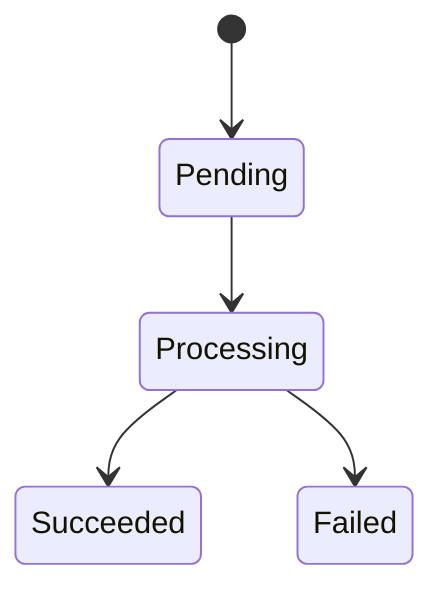

# VX.Y 详细设计

## 1. 通用约束

### 1.1 数据 Schema

- 存储结构：
- key 命名规则：
- 索引设计：

### 1.2 API 契约

- 调用顺序：
- 前置条件：
- 返回值约定：

### 1.3 异常与边界

- 失败重试：
- 并发冲突：
- 配额不足：
- 大数据量：

## 2. TF1 详细设计

### 2.1 目标

- 该流要完成什么：
- 成功条件：

### 2.2 步骤拆解

1. 第一步：
2. 第二步：
3. 第三步：

### 2.3 函数签名与伪代码

- 关键函数签名（函数名、入参类型、返回值类型、调用时机）：
```text
func StepA(input: InputType) -> (OutputType, error)
  // 前置条件：
  // 调用时机：
```

```text
if 前置条件不满足:
  return 失败原因

执行步骤 A
执行步骤 B
根据结果决定下一步
```

### 2.4 输入输出与前置条件

- 输入：
- 输出：
- 前置条件：
- 后置条件：

### 2.5 异常与边界

- 异常场景：
- 回退策略：
- 重试策略：

## 3. TF2 详细设计

### 3.1 目标

- 该流要完成什么：
- 成功条件：

### 3.2 步骤拆解

1. 第一步：
2. 第二步：
3. 第三步：

### 3.3 函数签名与伪代码

- 关键函数签名（函数名、入参类型、返回值类型、调用时机）：
```text
func StepA(input: InputType) -> (OutputType, error)
  // 前置条件：
  // 调用时机：
```

```text
if 前置条件不满足:
  return 失败原因

执行步骤 A
执行步骤 B
根据结果决定下一步
```

### 3.4 输入输出与前置条件

- 输入：
- 输出：
- 前置条件：
- 后置条件：

### 3.5 异常与边界

- 异常场景：
- 回退策略：
- 重试策略：

## 4. 风险与缓解

| 风险 | 影响 | 缓解措施 |
|---|---|---|
|  |  |  |

## 5. 状态机 / 时序图

> 当 Transaction Flow 涉及复杂异步状态或跨端交互时，本节必须补充文本状态机或时序图。


